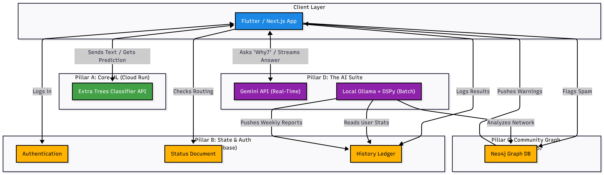

---

#  Master Architecture Blueprint: "Trust Issues"

**Project Vision:** A comprehensive, crowdsourced phishing and spam detection ecosystem that combines traditional Machine Learning, Graph-based threat intelligence, and Generative AI for user education and reporting.

## 1. The Core Components (The 4 Pillars)

### Pillar A: Core Machine Learning Engine (The Classifiers)
* **Hosting:** Google Cloud Run (Scales to zero, handles high traffic effortlessly).
* **The Models:** * **Email Model:** Dual-Vectorizer Extra Trees Classifier (ETC). Processes `subject` and `body` independently for ultra-high precision.
    * **SMS Model:** Multinomial Naive Bayes (or your chosen SMS model) trained on SMS syntax.
* **Function:** Pure, lightning-fast inference. Receives text, returns `1` (Spam) or `0` (Ham) with a confidence score.

### Pillar B: State, Auth & Routing (The Brain)
* **Hosting:** Firebase.
* **Functions:**
    * **Auth:** Handles secure user logins for the Flutter mobile app and Next.js web dashboard.
    * **History Ledger:** Stores a log of all messages a user has checked.
    * **Status Document:** A live configuration file. Tells the frontends whether to route requests to the Cloud Run production URLs or your local Ngrok URLs for testing.

### Pillar C: The Community Threat Graph (The Network)
* **Hosting:** Local Neo4j instance (exposed via Ngrok for the development/demo phase).
* **Function:** Maps the "Trust Issues" community. 
    * Nodes: Users, Phone Numbers, Email Addresses, URLs.
    * Edges: `FRIENDS_WITH`, `RECEIVED_FROM`, `FLAGGED_AS_SPAM`.
    * **The Magic:** If Siddharth flags a specific phishing link, the graph traverses his connections and instantly queues a warning for Krish, Sailendra, and anyone else in that network cluster if they receive the same link.

### Pillar D: The AI Suite (The Analysts)
* **Real-Time Spam Helper Buddy (Gemini API):**
    * *Speed:* Fast, synchronous.
    * *Role:* User-facing education. When an email gets blocked, the user taps "Why is this spam?". The app sends the text and the ETC model's verdict to Gemini, which replies in 2 seconds with: *"This claims to be HDFC bank, but the link actually goes to a Russian IP, and banks never ask for your PIN via email."*
* **Threat Intelligence Analyst (Local Ollama + DSPy):**
    * *Speed:* Slow, asynchronous (runs overnight or in the background).
    * *Role:* Deep data synthesis. Uses DSPy for strict prompt formatting to look at Firebase/Neo4j data and generate:
        1.  **Zero-Day Alerts:** Network-wide warnings about newly trending scams spreading through the graph.
        2.  **Personal Threat Landscapes:** Weekly tailored reports for individual users about what was blocked and their current vulnerability score.

---

## 2. System Data Flows (How it actually works)

Whenever you are building a new feature, refer to these flow paths to know which systems need to talk to each other.

### Flow 1: The Standard Check (Real-Time)
1.  User receives a suspicious email/SMS.
2.  Flutter/Next.js app checks the **Firebase Status Doc** for the active API URL.
3.  App sends the text payload to **Cloud Run (ETC Model)**.
4.  Cloud Run returns the classification (Spam/Ham).
5.  App displays the result and logs the transaction asynchronously to **Firebase History**.

### Flow 2: The Graph Warning (Real-Time)
1.  User explicitly marks a new, undetected message as "Spam".
2.  App sends the sender info/URL to the **Local Neo4j via Ngrok**.
3.  Neo4j creates a `[User] -[FLAGGED]-> [URL]` relationship.
4.  A Cypher query triggers, finding all friends of that user.
5.  A push notification or alert state is updated for those connected users.

### Flow 3: The Educational Breakdown (User-Initiated)
1.  User clicks "Explain this to me" on a blocked message.
2.  App sends the raw message + the "Spam" verdict to the **Gemini API**.
3.  Gemini streams back a conversational, educational breakdown of the phishing attempt.

### Flow 4: The Threat Intel Report (Batch Process)
1.  **Local Ollama** wakes up at 2:00 AM.
2.  It queries **Firebase** for a specific user's weekly stats (e.g., 12 spam SMS blocked, mostly finance-related).
3.  It generates the "Personal Threat Landscape" text.
4.  The text is pushed back up to **Firebase** into a `weekly_reports` collection, ready for the user to read over their morning coffee.

---

## 3. Development Phases & Priorities

To keep from getting overwhelmed, build this in strict phases:

* **Phase 1: The Core Loop (Current)**
    * Deploy the Extra Trees Classifier to Cloud Run.
    * Connect the frontend apps to Cloud Run and Firebase Auth.
    * *Goal: A working, standalone spam checker.*
* **Phase 2: The Helper**
    * Integrate the Gemini API for the "Explain this" button.
    * *Goal: Add instant educational value.*
* **Phase 3: The Graph**
    * Spin up Neo4j locally.
    * Write the Cypher queries to connect users and propagate warnings.
    * *Goal: Turn a single-player tool into a multiplayer security network.*
* **Phase 4: The Analyst**
    * Setup Ollama and DSPy locally.
    * Write the cron jobs/scripts to pull Firebase data, generate reports, and push them back.
    * *Goal: Establish long-term user retention through weekly personalized value.*

---
